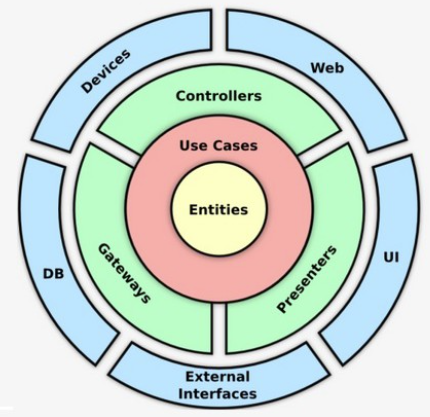
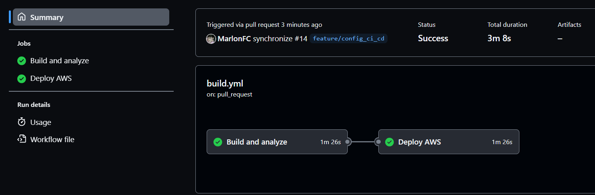
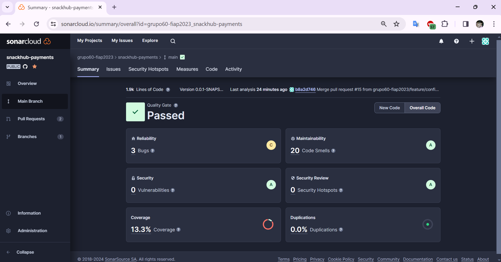
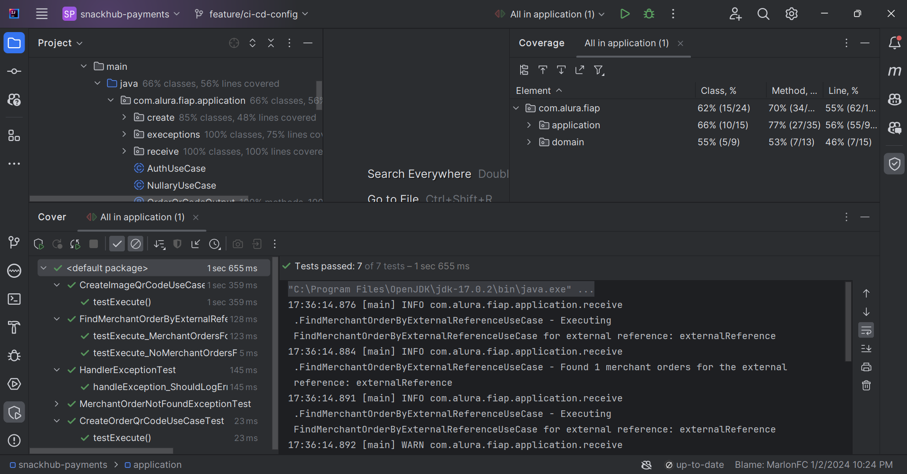
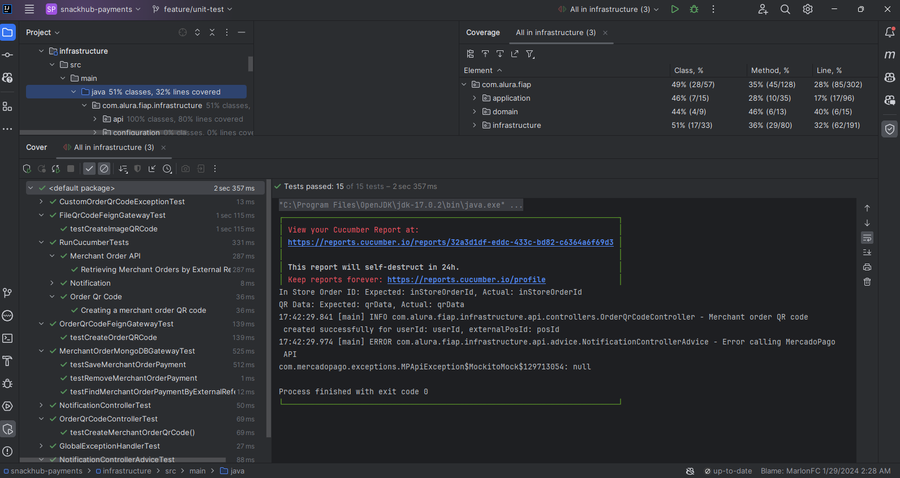
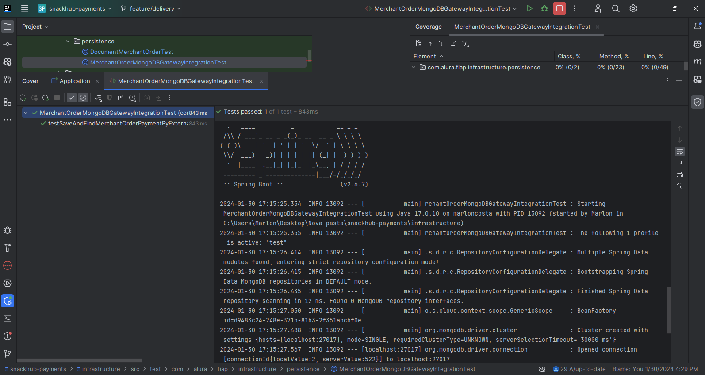
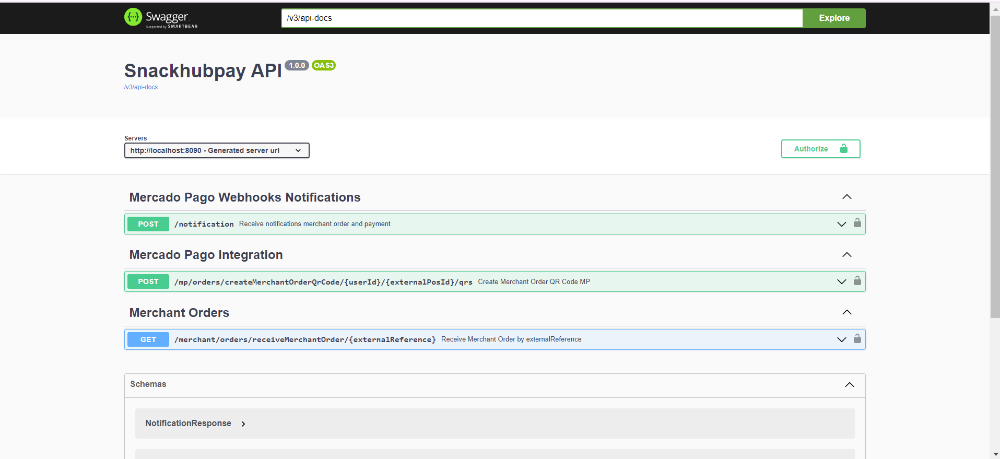
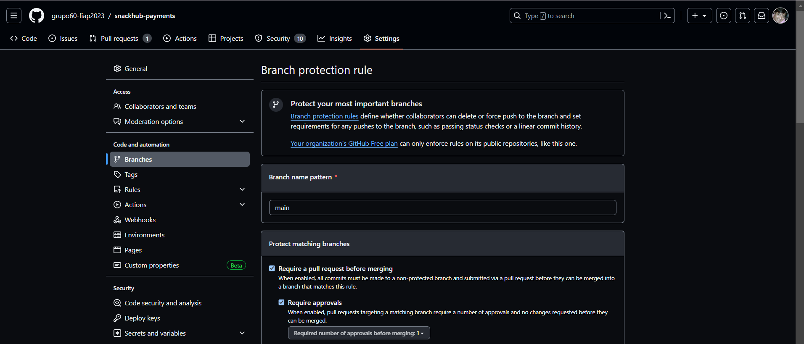
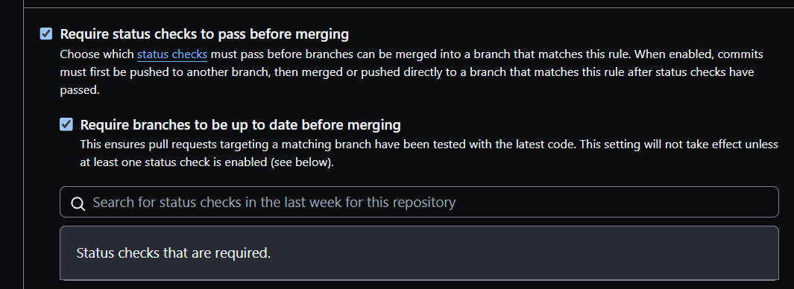
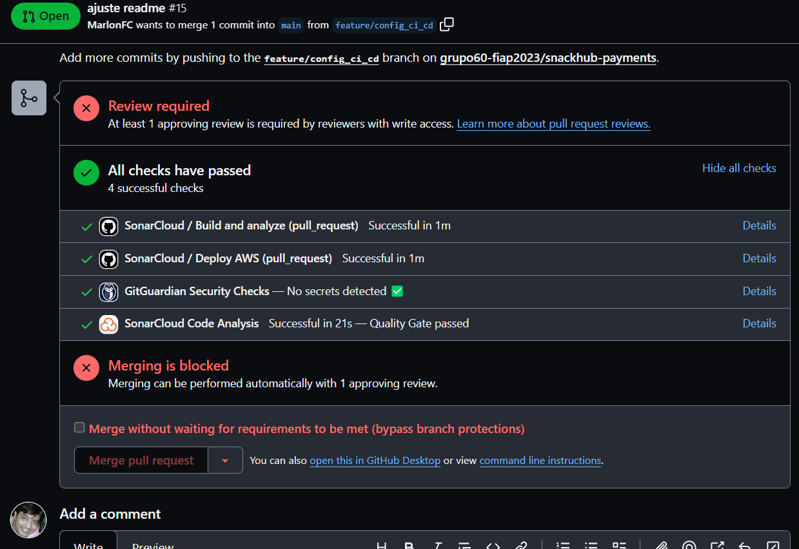

<center>
  <p align="center">
    
    
  </p>  
  <h1 align="center">MS SnackHub Pay com Clean Architecture</h1>
  <br align="center">
    Este projeto tem a finalidade educacional de um Microserviço responsável por receber um pedido de um estabelecimento de lanchonete e gerar o QRCode de pagamento do pedido realizando integração com o Mercado Pago, 
como parte do Tech Challenge do Curso de Arquitetura de Software.
</center>

# Conceito

## O que é Clean Architecture?

Clean Architecture, também conhecida como Arquitetura Limpa, é uma abordagem de desenvolvimento de software proposta por Robert C. Martin, um renomado engenheiro de software, autor e consultor. A principal ideia por trás da Clean Architecture é criar sistemas que sejam independentes de frameworks, banco de dados e detalhes de interface do usuário, enfatizando a separação de preocupações e a clareza na organização do código.

O objetivo da Clean Architecture é desenvolver sistemas altamente sustentáveis, testáveis e escaláveis, facilitando a manutenção contínua ao longo do tempo, permitindo a troca de componentes sem alterar a lógica central e tornando o código mais compreensível para novos desenvolvedores que trabalham no projeto.

Essa arquitetura promove a separação de preocupações e permite que cada camada se concentre em sua responsabilidade específica. A ideia é que as dependências fluam de dentro para fora, ou seja, as camadas internas não devem depender das camadas externas, tornando o sistema mais modular e independente.


## Decisão Arquitetural do Desafio

O projeto SnackHub possui três principais módulos:
* Domain
* Application
* Infrastructure

## Domain

Nesse módulo estão presente as nossas classes de dominio, projetadas com a utilização de práticas do DDD.
No cenário do Clean Architecture representam as Entities.

As classes presente nesse módulo não possuem nenhuma dependência externa ou de framework.

## Application

A camada de Use Case é responsável por implementar os casos de uso específicos do negócio da aplicação.
A caracteristica desse módulo é abstrair de regras de negócio: A camada de Use Case contém a lógica do negócio da aplicação, mas sem detalhes de implementação relacionados a infraestrutura ou apresentação.

## Infrastructure

A camada de infraestrutura é uma das camadas principais do Clean Architecture (Arquitetura Limpa) proposta por Robert C. Martin.
Essa camada é responsável por lidar com os detalhes técnicos, como o acesso a bancos de dados, serviços externos, sistemas de arquivos e outras tecnologias que não são específicas do domínio da aplicação. Sua principal função é permitir a comunicação entre a aplicação e o mundo externo, mantendo a lógica de negócio isolada e independente de detalhes de implementação.

# Persistência
No microserviço estamos utilizando um banco de dados NOSQL MongoDB.

# Cobertura e Qualidade

Nossa pipeline no Github Actions é realizada todas as etapas de build, 
análise e deploy da aplicação.

Na Step Build and analyze:



- Build do microserviço
- Execução de todos os tipos de testes
- Geração de relatórios de testes e cobertura
- Envio das informações do projeto ao SonarCloud

https://sonarcloud.io/summary/overall?id=grupo60-fiap2023_snackhub-payments



No SonarCloud é avaliado:
- Prováveis Bugs
- Qualidade do fonte
- Linhas duplicadas
- Conbertura do fonte por testes

Como pode ser visto na imagem e no link a Cobertura hoje do serviço está em 13%(Ciente do ajuste na config do report de coverage).


## Testes Implementados

Todos módulos implementados no serviço possuem testes de unidade implementados com o JUnit e boas práticas de BDD.



## BDD
Utilizado o Cumcumber nos BDD.



## Teste de Integração



## Como executar só com Docker?

**1. Subir a aplicação e o banco de dados MongoDB com Docker:**
```shell
docker-compose up -d
```

**2. URL de acesso:**

http://localhost:8080/swagger-ui/index.html#

# Step Deploy
O último step da pipeline realiza de forma automatizada o deploy para a AWS.


Serviço no ar:



# Proteção Repositório




# Merge Bloqueado main protegida
